# Todo List Odoo18

## About the module
This is a custom **Todo List** module for the Odoo ERP system. Developed as a practical project to demonstrate real-world use of Python and Odoo's framework, the module provides an internal task management system where users can create, assign, and track personal or collaborative to-do items. It supports tagging, user participation, real-time progress tracking, and is designed for internal users with full CRUD permissions.

## How to use and what you need
* This module is intended to be used within an existing Odoo installation.
* The **`__manifest__.py`** file defines the metadata and module dependencies.
* Key components:
   * **Models**: Define Todo Lists, Tasks, Tags, and Users.
   * **Views**: Provide form and list views with workflow buttons.
   * **Security**: Custom access groups and permissions for internal users.

* To install and use this module:
   * **Clone the repository** into your Odoo `addons` directory.
   * **Restart Odoo** and activate developer mode.
   * **Update the apps list** and install `Todo List` from the Apps menu.

## Basic usage
1. Log in as an internal user.
2. Go to the **"Todo List"** menu in the top navigation.
3. Use the **"All / Uncomplete / Complete"** submenus to filter the list.
4. Create a new Todo List and fill in the required fields (title, start date, end date).
5. Add participants and tasks directly from the form view.
6. Click **Start Progress** to begin the workflow, and **Done** when all tasks are completed.

## Introduction to the module
This module was built to provide a clean and extendable internal to-do management system for Odoo users. It showcases proper use of Odoo models, views, security, computed fields, and workflow buttons. The structure follows Odoo development standards and can be extended with additional logic such as email notifications or task deadlines.

## Website details
- When you open the website, you will see the Todo List App on the main dashboard.

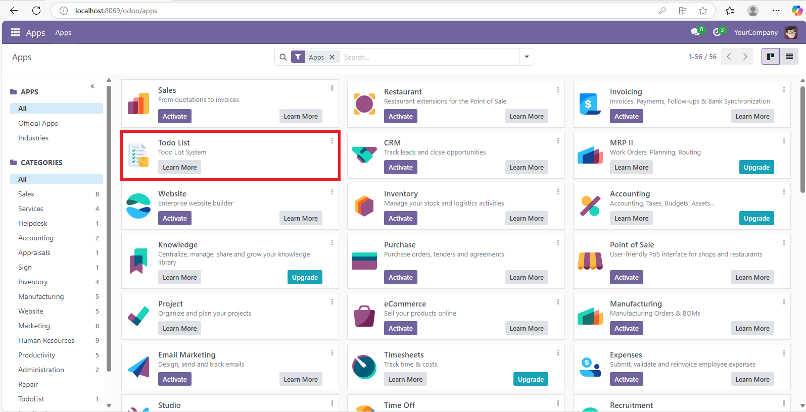

- In order to use the module, go to Settings → Users, and under the Access Rights tab, enable Todo List User access.

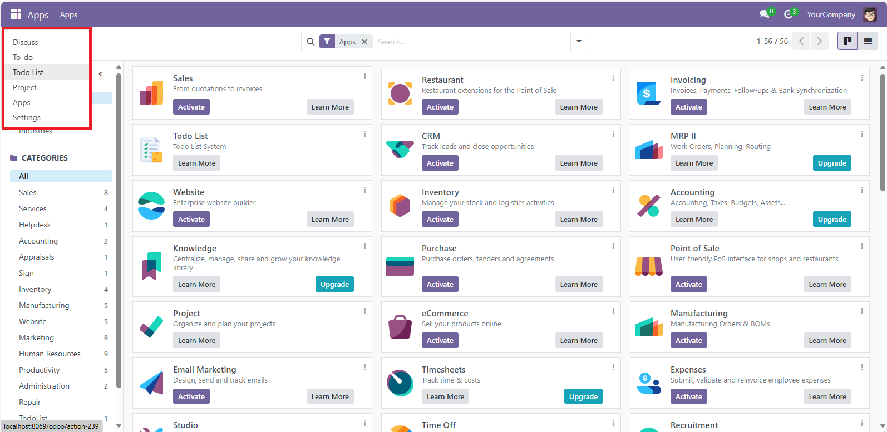

- Inside the Todo List menu, you will find three tabs:
    - All: Shows all Todo Lists.
    - Uncomplete: Shows lists that are not yet complete.
    - Complete: Shows lists that are marked as complete.

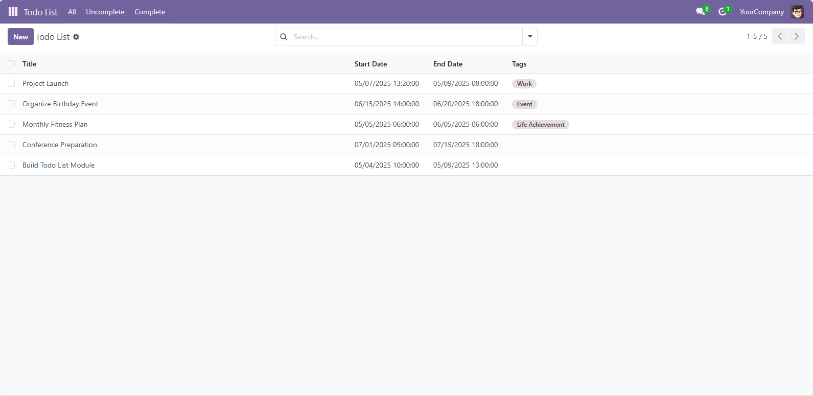

- By default, the view opens to the All tab. Click New to create a new Todo List.

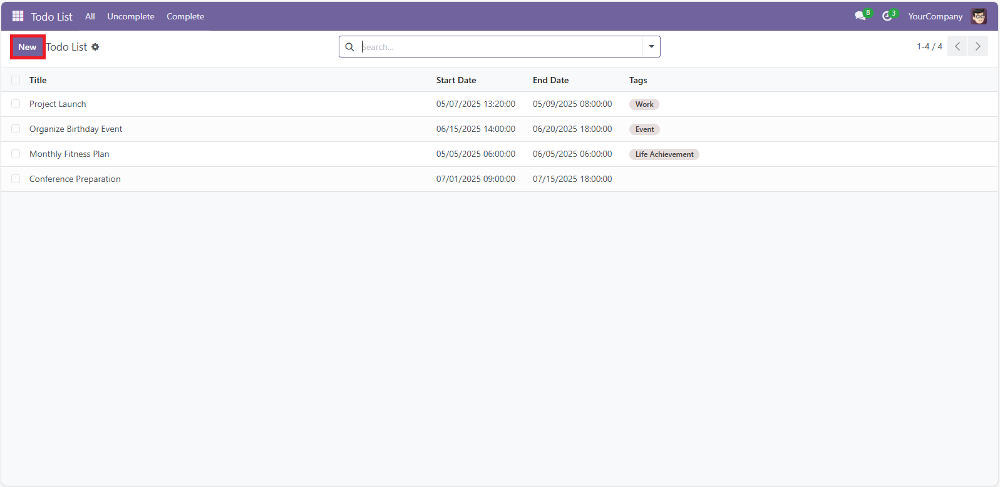

- A form will appear in the **Draft** state. Fill in the required fields such as title, tags, start date, and end date.
    - Click the Start Progress button to move to the **In Progress** state.

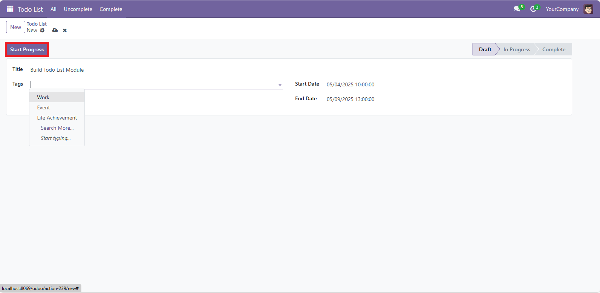

- In this state, two new buttons will appear: List and Attendees.
    - Under the **List** tab, you can add tasks with titles and descriptions.
    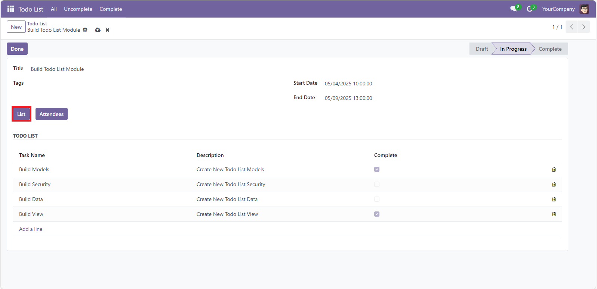

    - Then, switch to the **Attendees** tab and add users to participate in the Todo List.
        - After all tasks and attendees are added, click the Done button.
    
    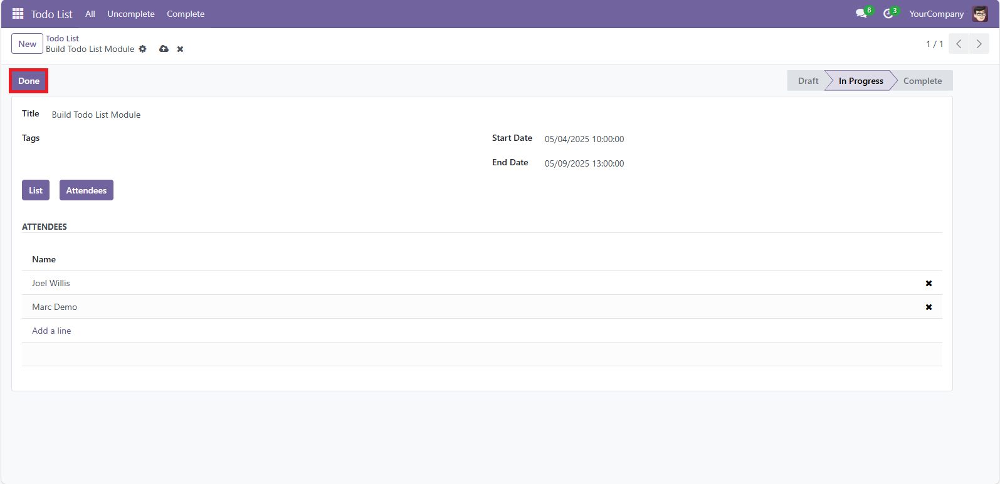

- The Todo List will now move to the **Complete** state, and all fields become **read-only** (non-editable).

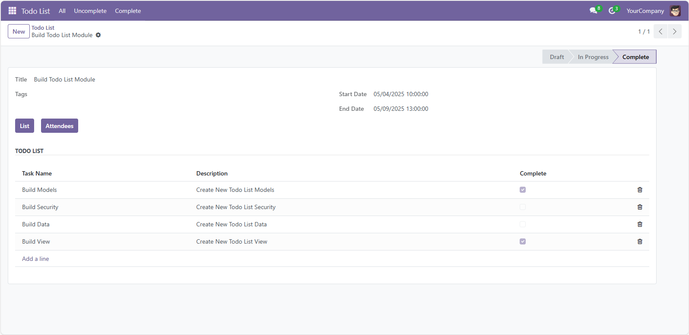

- Returning to the **All** tab, you will see the newly created Todo List.
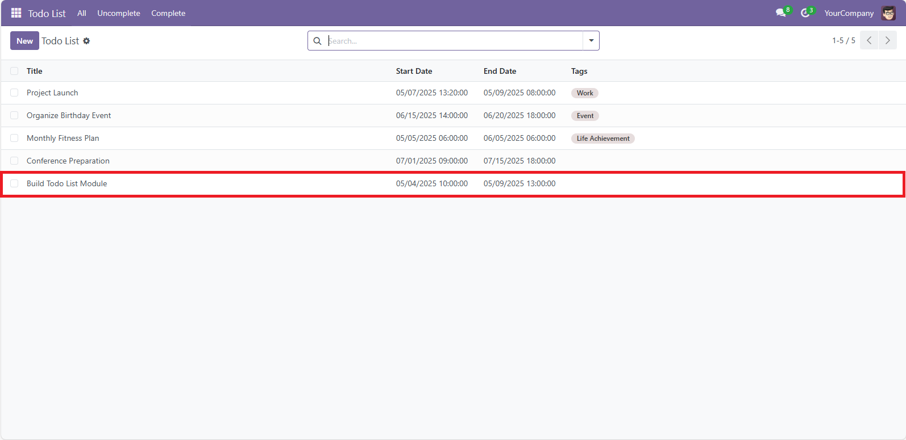

- In the **Uncomplete** tab, only lists that are not yet complete will be shown.
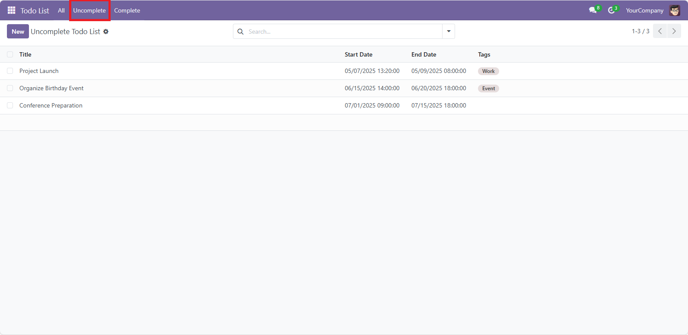

- In the **Complete** tab, only fully completed lists are displayed.
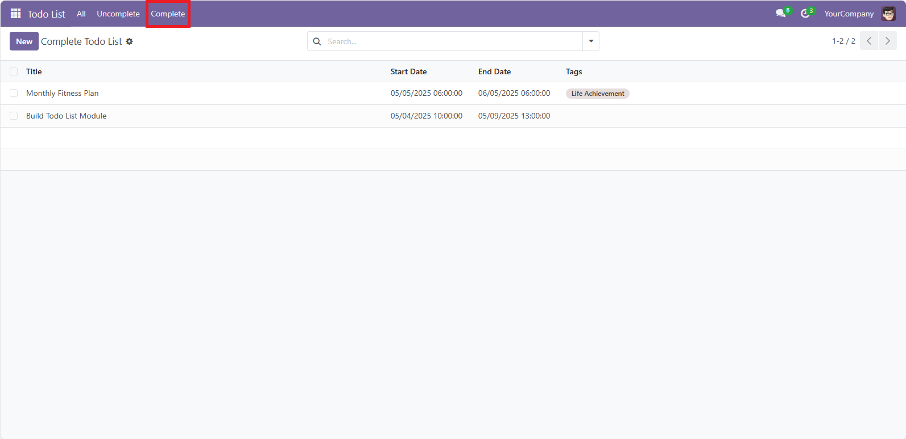

- To delete a Todo List, select the record from the list view, click Actions, then choose Delete.
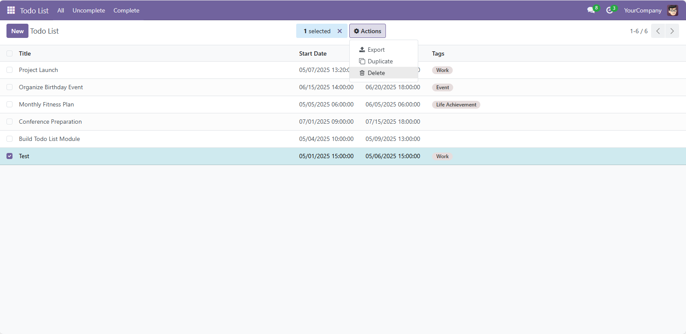

- The list will then be removed and no longer visible in any view.

### Postscript
This module was developed as an educational and practical demonstration of building a complete custom module in Odoo. It is open to improvements and extensions. If you find it useful or want to contribute, feel free to fork the repo or open an issue. Thank you for exploring this Odoo Todo List module!